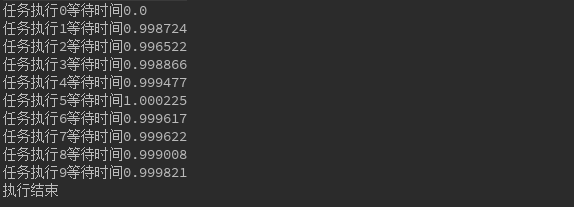
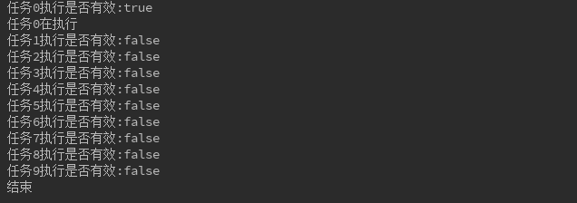
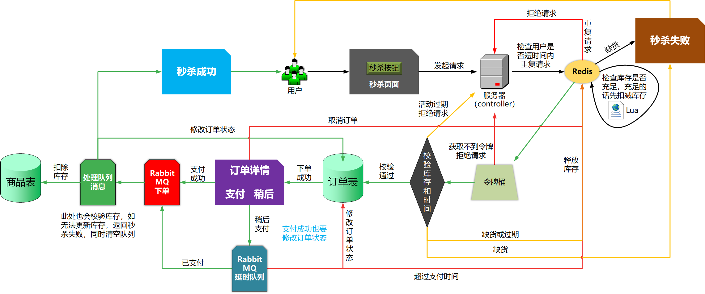
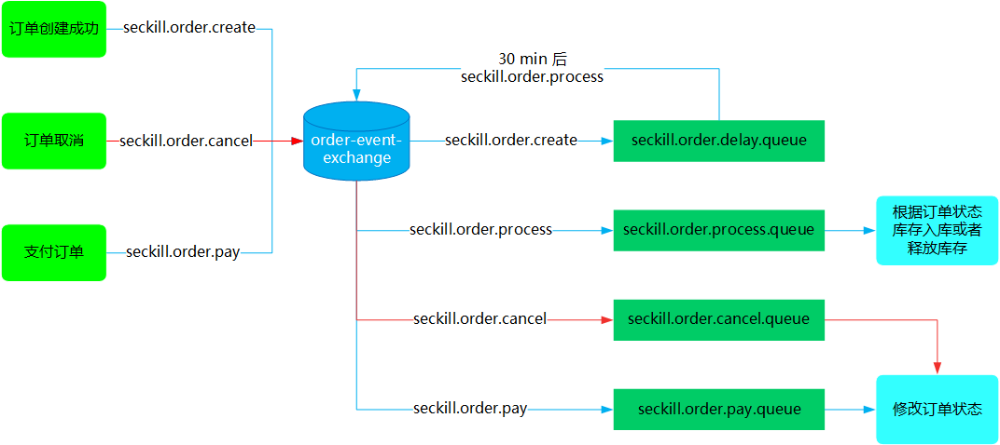

秒杀系统相信很多人见过，比如京东或者淘宝的秒杀，小米手机的秒杀，那么秒杀系统的后台是如何实现的呢？我们如何设计一个秒杀系统呢？对于秒杀系统应该考虑哪些问题？如何设计出健壮的秒杀系统？

当然，鉴于本人的菜鸡属性，目前的知识储备只够实现一个基于 SpringBoot + Mybatis-Plus + MySQL + Redis + RabbitMQ + Themleaf + HTML + CSS + JavaScript 的秒杀案例，因为主要考虑后端，前端界面会很简洁（就是很丑啦）。

# 1. 秒杀应该考虑哪些问题

## 1.1 超卖问题

分析秒杀的业务场景，最重要的有一点就是超卖问题，假如备货只有 100 个，但是最终超卖了 200 个，一般来讲秒杀系统的价格都比较低，如果超卖将严重影响公司的财产利益，因此首当其冲的就是解决商品的超卖问题。

## 1.2 高并发

秒杀具有时间短、并发量大的特点，秒杀持续时间只有几分钟，而一般公司都为了制造轰动效应，会以极低的价格来吸引用户，因此参与抢购的用户会非常的多。短时间内会有大量请求涌进来，后端如何防止并发过高造成缓存击穿或者失效，击垮数据库都是需要考虑的问题。

## 1.3 接口防刷

现在的秒杀大多都会出来针对秒杀对应的软件，这类软件会模拟不断向后台服务器发起请求，一秒几百次都是很常见的，如何防止这类软件的重复无效请求，防止不断发起的请求也是需要我们针对性考虑的。

## 1.4 秒杀 url

对于普通用户来讲，看到的只是一个比较简单的秒杀页面，在未达到规定时间，秒杀按钮是灰色的，一旦到达规定时间，灰色按钮变成可点击状态。这部分是针对小白用户的，如果是稍微有点电脑功底的用户，会通过 <kbd>F12</kbd>看浏览器的 network 看到秒杀的 url，通过特定软件去请求也可以实现秒杀，或者提前知道秒杀 url 的人，一请求就直接实现秒杀了。

## 1.5 数据库设计

秒杀有把我们服务器击垮的风险，如果让它与我们的其他业务使用在同一个数据库中，耦合在一起，就很有可能牵连和影响其他的业务。如何防止这类问题发生，就算秒杀发生了宕机、服务器卡死问题，也应该让他尽量不影响线上正常进行的业务。

## 1.6 大量请求问题

按照 1.2 的考虑，就算使用缓存还是不足以应对短时间的高并发的流量的冲击。如何承载这样巨大的访问量，同时提供稳定低时延的服务保证，是需要面对的一大挑战。我们来算一笔账，假如使用的是 redis 缓存，单台 redis 服务器可承受的 QPS 大概是 4 W 左右，如果一个秒杀吸引的用户量足够多的话，单 QPS 可能达到几十万，单体 redis 还是不足以支撑如此巨大的请求量。缓存会被击穿，直接渗透到数据库，从而击垮 MySQL，后台会将会大量报错。

# 2. 秒杀系统的设计和技术方案

## 2.1 秒杀系统数据库设计

针对 1.5 提出的秒杀数据库的问题，因此应该单独设计一个秒杀数据库 `dB_sec_kill`，防止因为秒杀活动的高并发访问拖垮整个网站。

这里字段类型有点随意，实际开发还得考虑准确性和效率

- `sec_goods`

  这里是参与秒杀的商品表，每一行代表一个活动

  |     字段名     |     类型     |      描述      |
  | :------------: | :----------: | :------------: |
  |       id       |     INT      |  自增（主键）  |
  |    good_id     | VARCHAR(12)  |  活动商品 id   |
  |   good_name    | VARCHAR(60)  |   活动商品名   |
  |  origin_price  | DECIMAL(5,2) |    原来价格    |
  | discount_price | DECIMAL(5,2) |    活动价格    |
  |     stock      |     INT      | 参与活动的库存 |
  |   start_time   |   DATETIME   |  活动开始时间  |
  |    end_time    |   DATETIME   |  活动结束时间  |

- `sec_orders`

  秒杀订单表，每一行代表一个订单

  |   字段名    |    类型     |                     描述                      |
  | :---------: | :---------: | :-------------------------------------------: |
  |  order_id   | VARCHAR(18) |                订单 id（主键）                |
  |    phone    |  CHAR(11)   |               手机号（unique）                |
  |    email    | VARCHAR(40) |                 用户电子邮箱                  |
  |   good_id   | VARCHAR(12) |                    商品 id                    |
  | create_time |  DATETIME   |                 订单创建时间                  |
  |   status    |     INT     | 0 表示订单完成， 1 表示待付款，2 表示订单取消 |

## 2.2 秒杀 url 的设计

为了避免有程序访问经验的人通过下单页面 url 直接访问后台接口来秒杀货品，我们需要将秒杀的 url 实现动态化，即使是开发整个系统的人都无法在秒杀开始前知道秒杀的 url。

思路：

1. 在进行秒杀之前，先请求一个服务端地址，`/seckillpath` 这个地址，用来获取秒杀地址，在服务端生成一个地址作为 `pathId` 存入缓存，（缓存过期时间 60 s），然后将这个地址返回给前端
2. 获得该 `pathId`，后 前端在用这个 `pathId` 拼接在 url 上作为参数，去请求 `/seckill` 服务
3. 后端接收到这个 `pathId` 参数，并且与缓存中的 `pathId` 比较

如果通过比较，进行秒杀逻辑，如果不通过，抛出业务异常，非法请求。

## 2.3 精简 SQL

典型的一个场景是在进行扣减库存的时候，传统的做法是先查询库存，再去 update。这样的话需要两个 SQL，而实际上一个 SQL 我们就可以完成的。可以用这样的做法：`update sec_goods set stock = stock - 1 where good_id = {#goods_id} and stock > 0;` 这样的话，就可以保证库存不会超卖并且一次更新库存。

## 2.4 Redis 预减库存

很多请求进来，都需要后台查询库存，这是一个频繁读的场景。可以使用 Redis 来预减库存，在秒杀开始前可以在 Redis 设值，比如`redis.set(goodsId,100)`，这里预放的库存为 100 可以设值为常量)，每次下单成功之后，`Integer stock = (Integer)redis.get(goosId);` 然后判断 `stock` 的值，如果小于常量值就减去 1；不过注意当取消的时候，需要增加库存，增加库存的时候也得注意不能大于之间设定的总库存数(查询库存和扣减库存需要原子操作，此时可以借助 Lua 脚本)，下次下单再获取库存的时候，直接从 Redis 里面查就可以了。

## 2.5 接口限流

秒杀最终的本质是数据库的更新，但是有很多大量无效的请求，我们最终要做的就是如何把这些无效的请求过滤掉，防止渗透到数据库。限流的话，需要入手的方面很多：

### 2.5.1 前端限流

首先第一步就是通过前端限流，用户在秒杀按钮点击以后发起请求，那么在接下来的 5 秒是无法点击(通过设置按钮为disable)。这一小举措开发起来成本很小，但是很有效。

### 2.5.2 同一个用户xx秒内重复请求直接拒绝

具体多少秒需要根据实际业务和秒杀的人数而定，一般限定为 10 秒。具体的做法就是通过 Redis 的键过期策略，首先对每个请求都从`String value = redis.get(userId);` 如果获取到这个 value 为空或者为 null，表示它是有效的请求，然后放行这个请求。如果不为空表示它是重复性请求，直接丢掉这个请求。如果有效，采用 `redis.setexpire(userId,value,10)`，value可以是任意值，一般放业务属性比较好，这个是设置以 userId 为 key，10 秒的过期时间(10 秒后，key 对应的值自动为 null)。

### 2.5.3 令牌桶算法限流

接口限流的策略有很多，我们这里采用令牌桶算法。令牌桶算法的基本思路是每个请求尝试获取一个令牌，后端只处理持有令牌的请求，生产令牌的速度和效率我们都可以自己限定，guava 提供了 `RateLimter` 的 API 供我们使用。以下做一个简单的例子，注意需要引入guava。

```java
public class TestRateLimiter {

    public static void main(String[] args) {
        //1秒产生1个令牌
        final RateLimiter rateLimiter = RateLimiter.create(1);
        for (int i = 0; i < 10; i++) {
            //该方法会阻塞线程，直到令牌桶中能取到令牌为止才继续向下执行。
            double waitTime= rateLimiter.acquire();
            System.out.println("任务执行" + i + "等待时间" + waitTime);
        }
        System.out.println("执行结束");
    }
}
```

上面代码的思路就是通过 `RateLimiter` 来限定我们的令牌桶每秒产生 1 个令牌(生产的效率比较低)，循环 10 次去执行任务。`acquire() ` 会阻塞当前线程直到获取到令牌，也就是如果任务没有获取到令牌，会一直等待。那么请求就会卡在我们限定的时间内才可以继续往下走，这个方法返回的是线程具体等待的时间。执行如下：



可以看到任务执行的过程中，第 1 个是无需等待的，因为已经在开始的第 1 秒生产出了令牌。接下来的任务请求就必须等到令牌桶产生了令牌才可以继续往下执行。如果没有获取到就会阻塞(有一个停顿的过程)。不过这个方式不太好，因为用户如果在客户端请求，如果较多的话，直接后台在生产 token 就会卡顿(用户体验较差)，它是不会抛弃任务的，我们需要一个更优秀的策略：**如果超过某个时间没有获取到，直接拒绝该任务**。接下来再来个案例：

```java
public class TestRateLimiter2 {

    public static void main(String[] args) {
        final RateLimiter rateLimiter = RateLimiter.create(1);

        for (int i = 0; i < 10; i++) {
            long timeOut = (long) 0.5;
            boolean isValid = rateLimiter.tryAcquire(timeOut, TimeUnit.SECONDS);
            System.out.println("任务" + i + "执行是否有效:" + isValid);
            if (!isValid) {
                continue;
            }
            System.out.println("任务" + i + "在执行");
        }
        System.out.println("结束");
    }
}
```

其中用到了 `tryAcquire()` 方法，这个方法的主要作用是设定一个超时的时间，如果在指定的时间内**预估(注意是预估并不会真实的等待)，**如果能拿到令牌就返回 true，如果拿不到就返回 false。然后我们让无效的直接跳过，这里设定每秒生产 1 个令牌，让每个任务尝试在 0.5 秒获取令牌，如果获取不到，就直接跳过这个任务(放在秒杀环境里就是直接抛弃这个请求)；程序实际运行如下：



只有第 1 个获取到了令牌，顺利执行了，下面的基本都直接抛弃了，因为 0.5 秒内，令牌桶( 1 秒 1 个)来不及生产就肯定获取不到返回false了。

**这个限流策略的效率有多高呢？假如我们的并发请求是 400 万瞬间的请求，将令牌产生的效率设为每秒20个，每次尝试获取令牌的时间是 0.05 秒，那么最终测试下来的结果是，每次只会放行 4 个左右的请求，大量的请求会被拒绝，这就是令牌桶算法的优秀之处。**

## 2.6 异步下单

为了提升下单的效率，并且防止下单服务的失败。需要将下单这一操作进行异步处理。最常采用的办法是使用队列，队列最显著的三个优点：**异步、削峰、解耦**。这里可以采用 RabbitMQ，在后台经过了限流、库存校验之后，流入到这一步骤的就是有效请求，然后发送到队列里，队列接受消息，异步下单。下完单，入库没有问题可以用邮件通知用户秒杀成功。假如失败的话，可以采用补偿机制，重试。

## 2.7 整体流程图



## 2.8 基于 RabbitMQ 死信队列的订单超时取消流程




